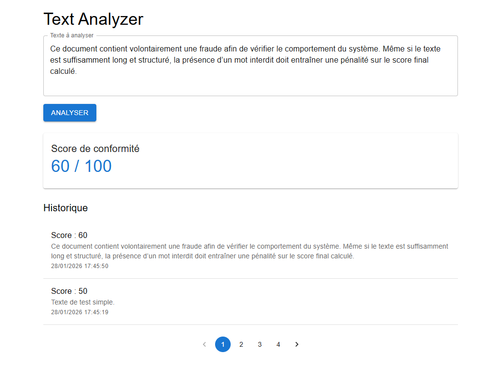

# BNJ TEST — Text Analyzer

### Application
<p align="center">
  
</p>

---
### Lancer le projet avec Docker
```json
docker-compose up --build
```
### Lancer le projet localement
#### Backend
```json
npm i
npm run start:dev (port 3100)
```
#### Frontend
```json
npm i
npm run start (port 3000)
```

## Stack technique

### Backend
- NestJS (Node.js + TypeScript)
- MongoDB
- TypeORM
- Validation avec class-validator

### Frontend
- React
- TypeScript
- Material UI (MUI)
- Appels API via fetch (sans axios)

### Infrastructure
- Docker
- Docker Compose

---

## Fonctionnalités

### Analyse de texte
- Saisie d’un texte à analyser
- Calcul d’un score de conformité (0 à 100)
- Règles appliquées :
  - +20 points si la longueur du texte est supérieure à 100 caractères
  - −10 points si le texte contient un mot interdit (`fraude`, `illégal`, `faux`)
  - Score borné entre 0 et 100

### Historique
- Sauvegarde automatique de chaque analyse
- Affichage de l’historique des analyses
- Pagination côté frontend (2 éléments par page)

---

## API — Endpoints

### `POST /api/analyze`
**Entrée**
```json
{
  "text": "mon texte à analyser"
}
```
**Sortie**

```json
{
  "score": 50
}
```

### `GET /api/history`
**Sortie**

```json
[
  {
    "id": "65b6f...",
    "text": "texte analysé",
    "score": 40,
    "createdAt": "2026-01-28T13:18:17Z"
  }
]
```
